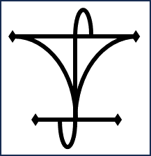

  

My name is Tobias Slade-Harajda and I am a 4th year Ph.D. student studying at the University of Warwick looking at simulated fusion plasmas and primarily measuring the effect of the tertiary ion concentration on the measured ion cyclotron emission (ICE) in D-T and aneutronic D-He3 plasmas.

ICE is a suprathermal emission brought on by instabilities within a fusion plasma. In its linear instability phase, the excitation mechanism for ICE is the magnetoacoustic cyclotron instability (MCI). As ICE is a passive diagnostic tool for fast ion physics, it is highly advantageous to apply knowledge gained from observing ICE to magnetically confined fusion (MCF) plasmas with the aim to improve tokamak efficiency and maintain the thermonuclear burn.

This project utilises HPC simulations to describe a minority energetic population of energetic (3.5MeV) alpha particles, and obtain typical ICE spectra observed in experiment. Further work will look at simulating aneutronic fusion reactions to mitigate the ionisation of the tokamak inner wall, hence increasing the efficiency of tokamaks and their longevity.

See also my [university page](https://warwick.ac.uk/fac/sci/physics/research/cfsa/people/slade-harajda/)

## Contents

* [Curriculum vitae](./cv.html)
* [Talks & posters](./talks.html)
* [Publications](./publications.html)
* [Teaching](./teaching.html)
* [Portfolio](./portfolio.html)

<!-- * <a href="http://tobiassh0.github.io/_pages/cv.html">CV</a>
* <a href="http://tobiassh0.github.io/_pages/cv.html">Talk</a>
* <a href="http://tobiassh0.github.io/_pages/publications.html">Publications</a>
* <a href="http://tobiassh0.github.io/_pages/Teaching.html">Teaching</a>
* <a href="http://tobiassh0.github.io/_pages/portfolio.html">Port</a>
 -->

### Other links

  

    
  

  

    
  

  

    
  

