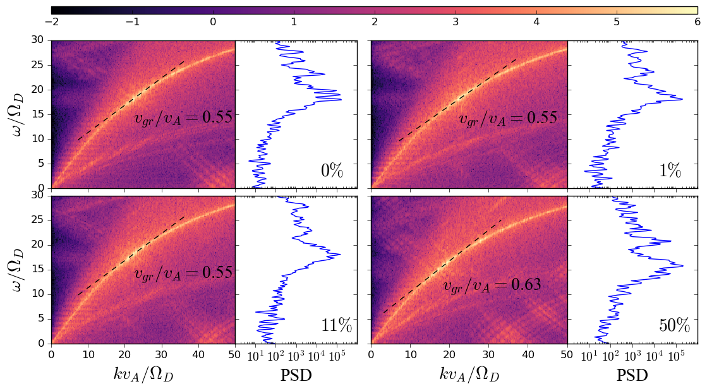
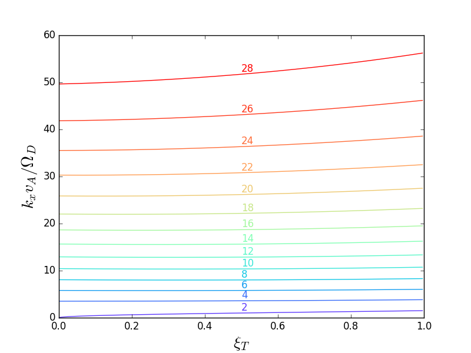
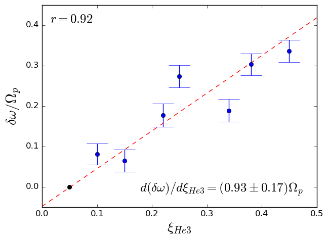
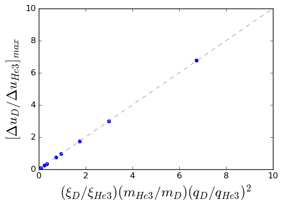
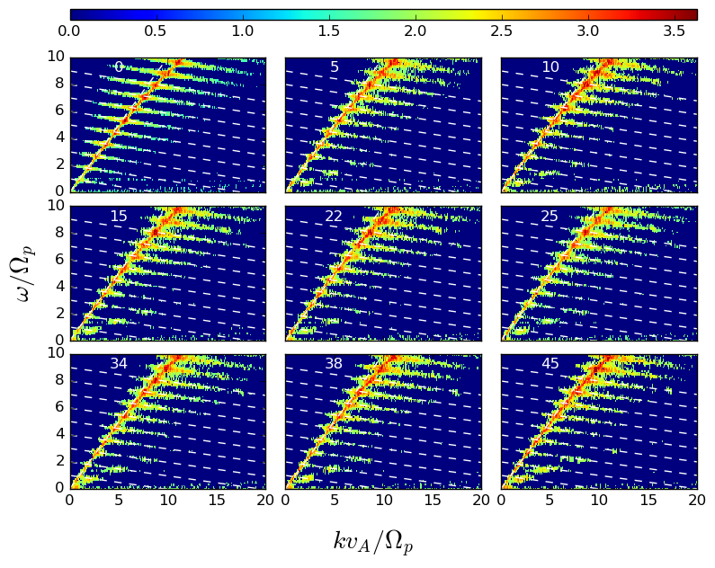
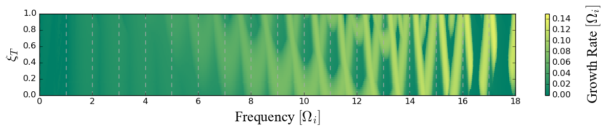
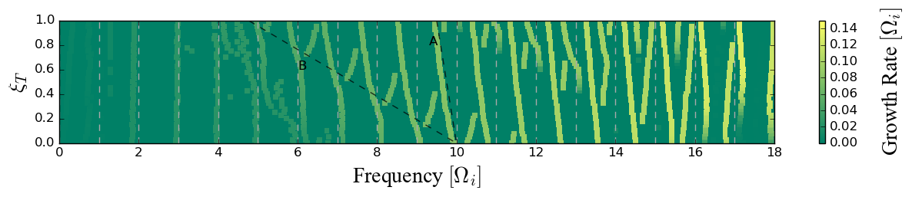

## Portfolio

Collection of images and videos created throughout my thesis that are interesting enough to share.

### Spatiotemporal Fourier transforms of DT plasma

  

### Cold plasma dispersion as a function of Tritium concentration

  

### Pearsons cross-correlation

  

### Gyro-resonance

  

### Spatiotemporal Fourier transforms of D-He3 plasma

  

### Growth rates as a function of frequency and tritium concentration

  

### Peak growth rates as a function of frequency and tritium concentration

  

[Home](./)
